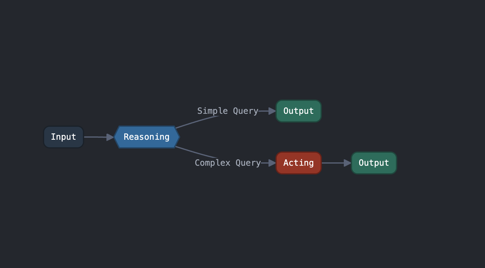

# 🔗 ts-edge 🔗

English | [한국어](./docs/kr.md)

A lightweight workflow engine for TypeScript that lets you create graph-based execution flows with type safety and minimal complexity.

## Features

- **Lightweight**: Minimal API and options that you can learn and apply quickly
- **Advanced Type Inference**: Compile-time validation ensures nodes can only connect when their input/output types match
- **Simple API**: Provides only essential functionality for ease of use
- **Flexible workflows**: Supports various patterns like conditional branching, parallel processing, and result merging

## Quick Start



```typescript
import { createGraph } from 'ts-edge';

// Define a simple AI agent workflow
const workflow = createGraph()
  .addNode({
    name: 'input',
    execute: (query: string) => ({ query }),
  })
  .addNode({
    name: 'reasoning',
    execute: (data) => {
      const isComplex = data.query.length > 20;
      return { ...data, isComplex };
    },
  })
  .addNode({
    name: 'acting',
    execute: (data) => {
      return { ...data, result: `Performed action for: ${data.query}` };
    },
  })
  .addNode({
    name: 'output',
    execute: (data) => {
      return { answer: data.result || `Simple answer for: ${data.query}` };
    },
  })
  .edge('input', 'reasoning')
  .dynamicEdge('reasoning', (data) => {
    return data.isComplex ? 'acting' : 'output';
  })
  .edge('acting', 'output');

// Compile and run the workflow
const app = workflow.compile('input', 'output');
const result = await app.run('What is the weather today?');
console.log(result.output); // { answer: "Simple answer for: What is the weather today?" }
```

## Overview

ts-edge lets you define computational workflows as directed graphs, where:

- **Nodes** process data and produce output
- **Edges** define the flow between nodes
- **Dynamic routing** makes decisions based on node outputs
- **Parallel execution** and **merge nodes** enable complex patterns

## Installation

```bash
npm install ts-edge
```

## Key Features

### Basic Node and Edge Definition

Nodes process input and produce output. Edges define the flow between nodes.

```typescript
const workflow = createGraph()
  .addNode({
    name: 'nodeA',
    execute: (input) => ({ value: input * 2 }),
  })
  .addNode({
    name: 'nodeB',
    execute: (input) => ({ result: input.value + 10 }),
  })
  .edge('nodeA', 'nodeB');
```

### Dynamic Routing

Make execution decisions based on node outputs:

```typescript
workflow.dynamicEdge('processData', (data) => {
  if (data.value > 100) return 'highValueProcess';
  if (data.value < 0) return 'errorHandler';
  return 'standardProcess';
});
```

### Parallel Processing with Merge Nodes


Process data in parallel branches and merge the results:

```typescript
const workflow = createGraph()
  .addNode({
    name: 'fetchData',
    execute: (query) => ({ query }),
  })
  .addNode({
    name: 'processBranch1',
    execute: (data) => ({ summary: summarize(data.query) }),
  })
  .addNode({
    name: 'processBranch2',
    execute: (data) => ({ details: getDetails(data.query) }),
  })
  .addMergeNode({
    name: 'combineResults',
    branch: ['processBranch1', 'processBranch2'],
    execute: (inputs) => ({
      result: {
        summary: inputs.processBranch1.summary,
        details: inputs.processBranch2.details,
      },
    }),
  })
  .edge('fetchData', ['processBranch1', 'processBranch2']);
```

### Execution Options

Control the behavior of your workflows:

```typescript
const result = await app.run(input, {
  timeout: 5000, // Maximum execution time in ms
  maxNodeVisits: 50, // Prevent infinite loops
});
```

### Start and End Nodes

When compiling a workflow, you specify:

- A required **start node** where execution begins
- An optional **end node** that explicitly marks the termination point

```typescript
// Both start and end nodes specified
const app = workflow.compile('inputNode', 'outputNode');

// Only start node specified - runs until a node with no outgoing edges
const app = workflow.compile('inputNode');
```

End node behavior:

- **When an end node is specified**: The workflow terminates when it reaches the end node and returns that node's output.
- **When no end node is specified**: The workflow runs until it reaches a leaf node (a node with no outgoing edges) and returns the output of the last executed node.

Specifying an end node is useful in complex workflows where you need to define a specific termination point.

### Event Subscription

Monitor workflow execution with events:

```typescript
app.subscribe((event) => {
  if (event.eventType === 'NODE_START') {
    console.log(`Starting node: ${event.node.name}`);
  }
});
```

### Middleware Support

Add middleware to intercept, modify, or redirect node execution:

```typescript
const app = workflow.compile('startNode');

// Add middleware
app.use((node, next) => {
  console.log(`About to execute node: ${node.name} with input:`, node.input);

  // Modify input
  if (node.name === 'validation') {
    next({ name: node.name, input: { ...node.input, validated: true } });
  }
  // Redirect execution flow
  else if (node.name === 'router' && node.input.special) {
    next({ name: 'specialHandler', input: node.input });
  }
});
```

## Error Handling

ts-edge provides a robust error handling system:

```typescript
const result = await app.run(input);
if (result.isOk) {
  console.log(result.output);
} else {
  console.error(result.error);
}
```

## Helper Functions

These helpers let you define nodes separately for better organization and reusability across files.

### `graphNode` - Create nodes

```typescript
import { graphNode } from 'ts-edge';

// Create a node
const userNode = graphNode({
  name: 'getUser',
  execute: (id: string) => fetchUser(id),
});

// Use in graph
graph.addNode(userNode);
```

### `graphMergeNode` - Create merge nodes

```typescript
import { graphMergeNode } from 'ts-edge';

// Create a merge node
const mergeNode = graphMergeNode({
  name: 'combine',
  branches: ['userData', 'userStats'],
  execute: (inputs) => ({ ...inputs.userData, stats: inputs.userStats }),
});

// Use in graph
graph.addMergeNode(mergeNode);
```

### `graphNodeRouter` - Create routers

```typescript
import { graphNodeRouter } from 'ts-edge';

// Create a router
const router = graphNodeRouter((data) => (data.isValid ? 'success' : 'error'));

// Use in graph
graph.dynamicEdge('validate', router);
```

## License

MIT
