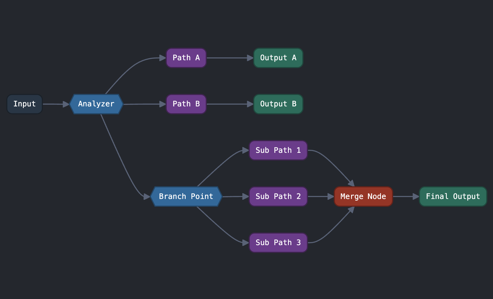

# 🔗 ts-edge 🔗

English | [한국어](./docs/kr.md)

A lightweight workflow engine for TypeScript that lets you create graph-based execution flows with type safety and minimal complexity.



## Contents

- [Features](#features)
- [Installation](#installation)
- [State-based Workflows](#state-based-workflows) - Main focus: Share state across nodes
- [Type-safe Workflows](#type-safe-workflows) - Ensure type compatibility between nodes
- [Key Features](#key-features)
- [Helper Functions](#helper-functions)

## Features

- **Lightweight**: Minimal API and options that you can learn and apply quickly
- **Advanced Type Inference**: Compile-time validation ensures nodes can only connect when their input/output types match
- **Simple API**: Provides only essential functionality for ease of use
- **Flexible workflows**: Supports various patterns like conditional branching, parallel processing, and result merging
- **State Management**: Built-in store for state-based workflows

## Installation

```bash
npm install ts-edge
```

## State-based Workflows

The main focus of ts-edge is providing state-based workflows where nodes operate on shared state:

```typescript
import { createStateGraph, graphStore } from 'ts-edge';

// Define counter state type
type CounterState = {
  count: number;
  name: string;
};

// Create a state store using graphStore
const store = graphStore<CounterState>({
  count: 0,
  name: '',
});

// Create a state-based workflow
// In state-based workflows, nodes share and modify common state
// Note: Return values from state nodes are ignored
const workflow = createStateGraph(store)
  .addNode({
    name: 'increment',
    execute: ({ state, setState }) => {
      // Store type is automatically inferred
      // Access state
      console.log(state); // {count:?, name:?}

      // Update state with function-based setter
      setState((prev) => {
        return { count: prev.count + 1 };
      });
    },
  })
  .addNode({
    name: 'checkCount',
    execute: ({ state }) => {
      // Perform logic based on state
      console.log(`Current count: ${state.count}`);
    },
  })
  .addNode({
    name: 'reset',
    execute: ({ setState }) => {
      // Reset state
      setState({ count: 0, name: '' });
    },
  })
  .edge('increment', 'checkCount')
  .dynamicEdge('checkCount', ({ state }) => {
    // Determine next node based on state
    return state.count > 10 ? 'reset' : 'increment';
  });

// Compile and run the workflow
const app = workflow.compile('increment');
const result = await app.run(); // Start with initial state
// Or start with partial state: await app.run({name:'user'});

console.log(result.output); // {state, setState} object
```

When defining nodes in separate files, use `graphStateNode` with explicit type inference:

```typescript
import { graphStateNode, graphStore } from 'ts-edge';

// Define state and create store
type CounterState = { count: number };
const store = graphStore<CounterState>({ count: 0 });

// Get store type for external node definition
type CounterStore = graphStore.infer<CounterState>;

// Define node in separate file/module
const countNode = graphStateNode({
  name: 'processCount',
  execute: ({ state, setState }: CounterStore) => {
    if (state.count < 10) {
      setState({ count: 10 });
    }
  },
});

// Use in state graph
const stateGraph = createStateGraph(store);
stateGraph.addNode(countNode);
```

## Type-safe Workflows

Traditional workflows in ts-edge enforce type safety between connected nodes:

```typescript
import { createGraph } from 'ts-edge';

// Each node receives the output of the previous node as its input
// TypeScript validates type compatibility between connected nodes at compile time
const workflow = createGraph()
  .addNode({
    name: 'number to string',
    execute: (input: number) => {
      // Convert number to string
      return `Input received: ${input}`;
    },
  })
  .addNode({
    name: 'string to boolean',
    execute: (input: string) => {
      // Convert string to boolean
      return input !== '';
    },
  })
  .addNode({
    name: 'boolean to array',
    execute: (input: boolean) => {
      // Convert boolean to array
      return input ? [] : [1, 2, 3];
    },
  })
  .edge('number to string', 'string to boolean') // Type check passes
  // .edge('number to string', 'boolean to array')  // ❌ Type error
  .edge('string to boolean', 'boolean to array'); // Type check passes

// Compile and run the workflow
const app = workflow.compile('number to string');
const result = await app.run(100);
console.log(result.output); // [1,2,3]
```

## Key Features

### Basic Node and Edge Definition

Nodes process input and produce output. Edges define the flow between nodes. Nodes can include optional metadata for documentation or visualization purposes.

```typescript
const workflow = createGraph()
  .addNode({
    name: 'nodeA',
    execute: (input: number) => ({ value: input * 2 }),
    metadata: { description: 'Doubles the input value', category: 'math' },
  })
  .addNode({
    name: 'nodeB',
    execute: (input: { value: number }) => ({ result: input.value + 10 }),
    metadata: { description: 'Adds 10 to the value' },
  })
  .edge('nodeA', 'nodeB');
```

### Node Execution Context

Each node's execute function can receive a context object as a second argument:

```typescript
addNode({
  name: 'streamingNode',
  metadata: { version: 1, role: 'processor' },
  execute: (input, context) => {
    // Access node metadata
    console.log(context.metadata); // { version: 1, role: 'processor' }

    // Emit stream events (useful for reporting progress during execution)
    context.stream('Processing started...');
    // Perform work
    context.stream('50% complete');
    // Final result
    return { result: 'Completed' };
  },
});
```

### Dynamic Routing

Make execution decisions based on node outputs:

```typescript
workflow.dynamicEdge('processData', (data) => {
  if (data.value > 100) return ['highValueProcess', 'standardProcess']; // Route to multiple nodes
  if (data.value < 0) return 'errorHandler'; // Route to a single node
  return 'standardProcess'; // Default path
});
```

For better visualization and documentation, you can specify possible targets:

```typescript
workflow.dynamicEdge('processData', {
  possibleTargets: ['highValueProcess', 'errorHandler', 'standardProcess'],
  router: (data) => {
    if (data.value > 100) return ['highValueProcess', 'standardProcess'];
    if (data.value < 0) return 'errorHandler';
    return 'standardProcess';
  },
});
```

### Parallel Processing with Merge Nodes

Process data in parallel branches and merge the results:

```typescript
const workflow = createGraph()
  .addNode({
    name: 'fetchData',
    execute: (query) => ({ query }),
  })
  .addNode({
    name: 'processBranch1',
    execute: (data) => ({ summary: summarize(data.query) }),
  })
  .addNode({
    name: 'processBranch2',
    execute: (data) => ({ details: getDetails(data.query) }),
  })
  .addMergeNode({
    name: 'combineResults',
    branch: ['processBranch1', 'processBranch2'], // Branches to merge
    execute: (inputs) => ({
      // inputs object contains outputs from each branch node
      result: {
        summary: inputs.processBranch1.summary,
        details: inputs.processBranch2.details,
      },
    }),
  })
  .edge('fetchData', ['processBranch1', 'processBranch2']); // One node to many nodes
```

### State Management

ts-edge provides two ways to create stores:

#### 1. createGraphStore - Zustand-style advanced state management

```typescript
type CounterStore = {
  count: number;
  increment(): void;
  decrement(): void;
  reset(): void;
};

// Create an advanced store with actions
const counterStore = createGraphStore<CounterStore>((set, get) => ({
  count: 0,
  increment: () => set({ count: get().count + 1 }),
  decrement: () => set((state) => ({ count: state.count - 1 })),
  reset: () => set({ count: 0 }),
}));

const node = graphStateNode({
  name: 'increment-node',
  execute: (state: CounterStore) => {
    if (state.count < 5) {
      state.increment();
    } else {
      state.reset();
    }
  },
});

const workflow = createStateGraph(counterStore).addNode(node);
```

#### 2. graphStore - A wrapper for simple state objects

```typescript
type CounterState = {
  count: number;
  name: string;
};

// Create a simple store (uses createGraphStore internally)
const counterStore = graphStore<CounterState>({
  count: 0,
  name: '',
});

// Extract store type
type CounterStore = graphStore.infer<typeof counterStore>;

const node = graphStateNode({
  name: 'increment-node',
  execute: ({ state, setState }: CounterStore) => {
    if (state.count < 5) {
      setState((prev) => ({ count: prev.count + 1 }));
    } else {
      setState({ count: 0 });
    }
  },
});

const workflow = createStateGraph(counterStore).addNode(node);
```

### Execution Options

Control the behavior of your workflows:

```typescript
// Basic execution
const result = await app.run(input);

// Execution with options
const resultWithOptions = await app.run(input, {
  timeout: 5000, // Maximum execution time in ms
  maxNodeVisits: 50, // Prevent infinite loops
});

// State graph initialization
const stateResult = await stateApp.run({ count: 10, name: 'test' }); // Initialize with partial state

// Prevent state reset
const noResetResult = await stateApp.run(undefined, {
  noResetState: true, // Don't reset state before execution
});
```

### Start and End Nodes

When compiling a workflow, you can specify:

```typescript
// Only specify start node - runs until a node with no outgoing edges
const app = workflow.compile('inputNode');

// Specify both start and end nodes - terminates at end node
const appWithEnd = workflow.compile('inputNode', 'outputNode');
```

- **When an end node is specified**: The workflow terminates when it reaches the end node and returns that node's output.
- **When no end node is specified**: The workflow runs until it reaches a leaf node (a node with no outgoing edges) and returns the output of the last executed node.

### Event Subscription

Monitor workflow execution with events:

```typescript
app.subscribe((event) => {
  // Workflow start event
  if (event.eventType === 'WORKFLOW_START') {
    console.log(`Workflow started with input:`, event.input);
  }

  // Node start event
  else if (event.eventType === 'NODE_START') {
    console.log(`Node started: ${event.node.name}, input:`, event.node.input);
  }

  // Node stream event (triggered by context.stream calls)
  else if (event.eventType === 'NODE_STREAM') {
    console.log(`Stream from node ${event.node.name}: ${event.node.chunk}`);
  }

  // Node end event
  else if (event.eventType === 'NODE_END') {
    if (event.isOk) {
      console.log(`Node completed: ${event.node.name}, output:`, event.node.output);
    } else {
      console.error(`Node error: ${event.node.name}, error:`, event.error);
    }
  }

  // Workflow end event
  else if (event.eventType === 'WORKFLOW_END') {
    if (event.isOk) {
      console.log(`Workflow completed with output:`, event.output);
    } else {
      console.error(`Workflow error:`, event.error);
    }
  }
});
```

### Middleware Support

Add middleware to intercept, modify, or redirect node execution:

```typescript
const app = workflow.compile('startNode');

// Add middleware
app.use((node, next) => {
  console.log(`About to execute node: ${node.name}, input:`, node.input);

  // Modify input and continue with same node
  if (node.name === 'validation') {
    next({ name: node.name, input: { ...node.input, validated: true } });
  }

  // Redirect execution flow to a different node
  else if (node.name === 'router' && node.input.special) {
    next({ name: 'specialHandler', input: node.input });
  }

  // Continue normal execution flow
  else {
    next();
  }

  // Not calling next() would stop execution
});
```

### Error Handling

ts-edge provides a robust error handling system:

```typescript
try {
  const result = await app.run(input);

  if (result.isOk) {
    console.log('Success:', result.output);
  } else {
    console.error('Execution error:', result.error);
  }
} catch (error) {
  console.error('Unexpected error:', error);
}
```

## Helper Functions

These helpers let you define nodes separately for better organization and reusability across files.

### `graphNode` - Create nodes

```typescript
import { graphNode } from 'ts-edge';

// Create a node
const userNode = graphNode({
  name: 'getUser',
  execute: (id: string) => fetchUser(id),
  metadata: { description: 'Fetches user data' },
});

// Infer types
type UserNodeType = graphNode.infer<typeof userNode>;
// { name: 'getUser', input: string, output: User }

// Use in graph
graph.addNode(userNode);
```

### `graphMergeNode` - Create merge nodes

```typescript
import { graphMergeNode } from 'ts-edge';

// Create a merge node
const mergeNode = graphMergeNode({
  name: 'combine',
  branch: ['userData', 'userStats'],
  execute: (inputs) => ({ ...inputs.userData, stats: inputs.userStats }),
});

// Use in graph
graph.addMergeNode(mergeNode);
```

### `graphNodeRouter` - Create routers

```typescript
import { graphNodeRouter } from 'ts-edge';

// Create a simple router
const simpleRouter = graphNodeRouter((data) => (data.isValid ? 'success' : 'error'));

// Create a router with explicit targets
const complexRouter = graphNodeRouter(['success', 'warning', 'error'], (data) => {
  if (data.score > 90) return 'success';
  if (data.score > 50) return 'warning';
  return 'error';
});

// Use in graph
graph.dynamicEdge('validate', simpleRouter);
```

### `graphStateNode` - Create state nodes

```typescript
import { graphStateNode, graphStore } from 'ts-edge';

// Define state type
type CounterState = {
  count: number;
};

// Create store
const store = graphStore<CounterState>({ count: 0 });

// Extract store type
export type CounterStore = graphStore.infer<CounterState>;

// Create a state node
const countNode = graphStateNode({
  name: 'processCount',
  execute: ({ state, setState }: CounterStore) => {
    if (state.count < 10) {
      setState({ count: 10 });
    }
  },
  metadata: { description: 'Process count' },
});

// Use in state graph
const stateGraph = createStateGraph(store);
stateGraph.addNode(countNode);
```

## License

MIT
